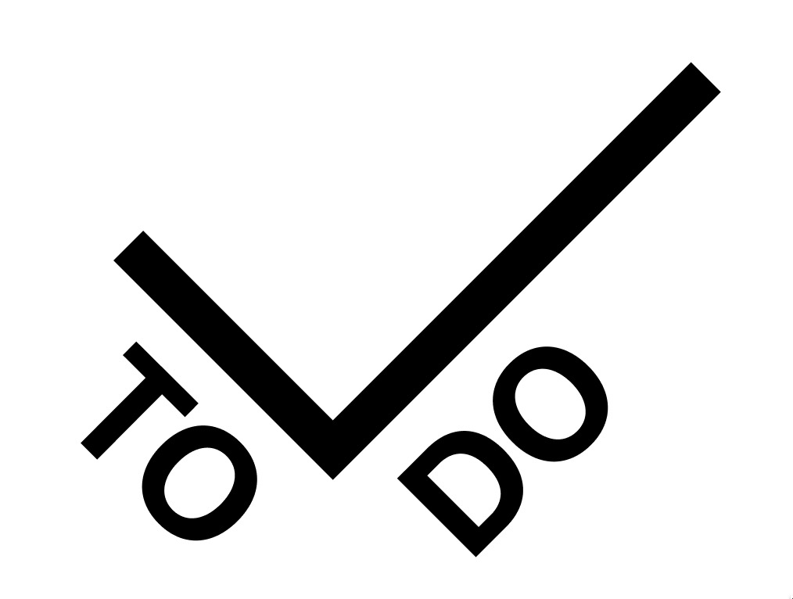
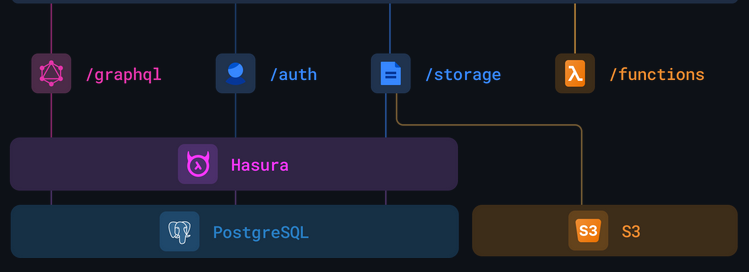

<h1 align="center">
   
  Block { ToDo }
</h1>

Todo Applications might look easy to code and develop. But we present to you the most complicated Todo Appication, works normal and simple from client side but having one of the most complex backend powered over<b>Polygon blockchain</b> and Multiple databases 

<!-- 
&nbsp;&nbsp;&nbsp;
 -->

## Explore the project

> 🔔 Give us a star if you like our project

- Try out our project: \
   Get the APK from [here](https://drive.google.com/file/d/1L82VDwbkKIyOg67HLLnct7xHeDVYHbAp/view?usp=drivesdk)

- Contracts:

  - ToDo contract:

    - address: 0x265b3A66C5De52825b24c70aFfb6dE2974FAFd03
    - explore: [visit](https://mumbai.polygonscan.com/address/0x265b3A66C5De52825b24c70aFfb6dE2974FAFd03)

  - Coins contract:
    - address: 0xcb15573cb5E218F3dfc627C924542351550B3C06
    - explore: [visit](https://mumbai.polygonscan.com/address/0xcb15573cb5E218F3dfc627C924542351550B3C06)

- More Into the project: \
   Read more about out project from [here](https://docs.google.com/document/d/1oTUKPNjxpGbc3ueE1pN_lV5chKYRoUUrx8IfY-WHiGc/)

The best way to better explore all the features of the **Block ToDo** is to fork and try out the project yourself and understand the complex structure of backend

## ⚙️ Tech Stack

- Solidity
- Hardhat
- Hardhat-toolbox
- Flutter
- Dart
- Nodejs
- Express
- MongoDB
- Nhost
- Pocketbase
- Solidity-coverage
- Truffle
- HD wallet
- Ethers
- Web3js
- Bcrypt
- Ganache-CLI
- Alchemy
- Polygon Matic
- Remix
- UNO & DIO
- Lottie
- Firebase
- Vercel
- Metamask
- GraphQL (Hasura)

### Backend

- Backend is developed using [Nodejs](https://nodejs.org/en/) and [Express](https://expressjs.com/):
  - JWT as a stateless authentication mechanisms for users and providers
  - MongoDB and pocketbase to serve simultaneously as database
  - nHost \
  
  - Bcrypt to encrypt passwords and auth

### Frontend

- Users can signup/signin with Google-auth (firebase) or Email/password 
- Add / Delete / Modify /complete a task
- Captcha for adding a task.
    - Slider captcha to prevent bots
    - Most user friendly captcha method
- Claim / Spend Reward coins
- Set A deadline to complete the task and earn rewards
- Realtime monitoring of tasks added to prevent frauds

*Coins*
- Task completed before deadline && Task verified : +10 🪙
- Task cross deadline || unncessary tasks : -10 🪙\
- Spend coins in the Reward section for redeeming gifts & goodies

> ☝️ It was well and easy to create a website with frameworks like Vue, React or Nextjs. But the ultimate cross plaform compactable application with best possible efficiency and performance is done best using flutter

### Blockchain

- Contracts written and tested over hardhat and powered by polygon blockchain
- Cryptographically records each records to prevent any kind of fraudary or data breach
- **Data abstraction**: Users are not required to pay any kind of transaction fee or gas fee for any of the transations (*Please don't abuse the system over this*) 
- Web3js and ethers used over the express framework to keep live interaction with polygon blockchain
- ganache and truffle used as dependencies for development 
- Verified and source code published

> View the Logs and transactions : \
    - [Todo](https://mumbai.polygonscan.com/address/0x265b3A66C5De52825b24c70aFfb6dE2974FAFd03) \
    - [Coins](https://mumbai.polygonscan.com/address/0xcb15573cb5E218F3dfc627C924542351550B3C06) 

## 🚚 Features
**Cross Device compatible - Android, iOS, Windows, Linux**
- Authentication - Google-auth && Email-Password - Forgot password
- Dashboard - Add / Delete / Modify task
- Profile - View and Edit user profile
- Coins & Rewards - Earn coins for completing valid tasks & spend them to redeem gifts
- Cryptographic record of each task 
- Stored seperatly in MongoDB and pocketbase and then cross verified
- powerful nhosting service
- powerful backend powered over node-express
- encrypting records and data before writing to db

## ⭐️ Meet the Team
- Sachin Dapkara | LCS2021001 | [Github]()
- Palash Baderia | lcb2021015 | [Github](https://github.com/palashb01)
- Karthik S | LIT2021012 | [Github](https://github.com/KarthikS373)

